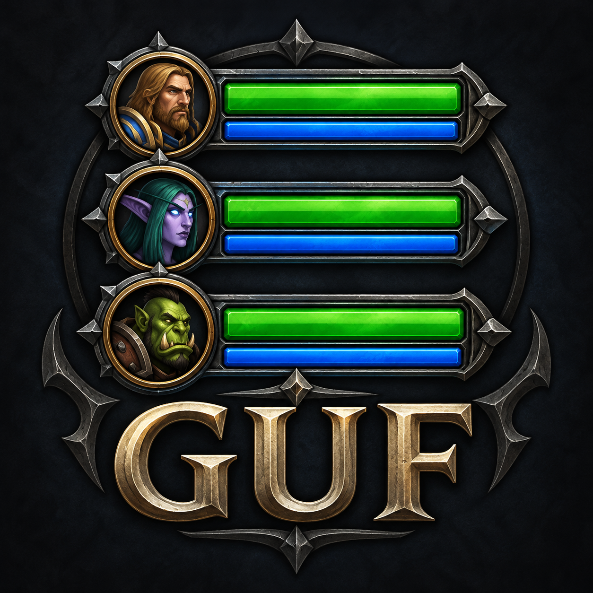
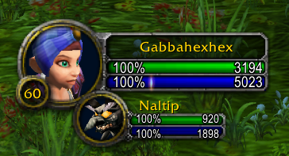
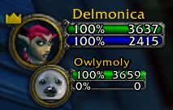
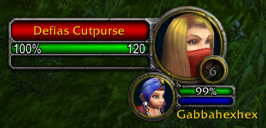
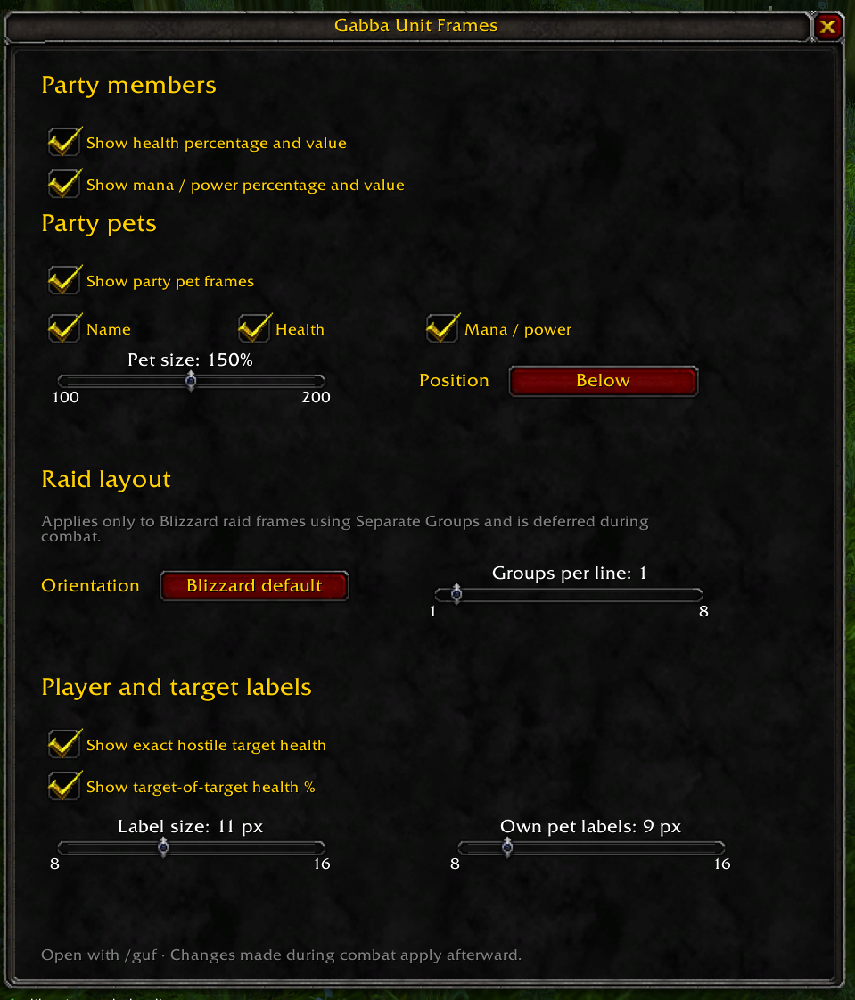

<p align="center">
  
</p>

<h1 align="center">Gabba Unit Frames</h1>

<p align="center">
  <strong>Your party at a glance. Your familiar Blizzard UI.</strong><br>
  Clear values, readable pet frames, and raid groups arranged to fit your screen. 💚
</p>

<p align="center">
  <a href="https://github.com/Gabbajoe/GabbaUnitFrames/actions/workflows/ci.yml"></a>
  <a href="https://github.com/Gabbajoe/GabbaUnitFrames/releases"></a>
  
  
  
  
</p>

<p align="center">
  <a href="https://github.com/Gabbajoe/GabbaUnitFrames/releases"><strong>📦 Downloads</strong></a> ·
  <a href="https://github.com/Gabbajoe/GabbaUnitFrames/issues"><strong>💬 Ideas &amp; issues</strong></a> ·
  <a href="CHANGELOG.md"><strong>📝 Changelog</strong></a> ·
  <a href="RELEASING.md"><strong>🛠️ Development</strong></a>
</p>

---

**Gabba Unit Frames** adds readable health and resource values and adjustable
layouts to Blizzard's party, pet, player, and target frames in **WoW Classic Era**.
Keep the familiar frames and choose the information you want to see.

A standalone addon with its own settings window and minimap button.
**No additional addons or external libraries required.**

## ✨ Features

| Area | What you can customize |
| --- | --- |
| 💚 **Party** | Health and resource percentages alongside exact values on portrait-style party frames |
| 🐾 **Party pets** | Scale from 100–200%, position below, left, or right; toggle names, health, and resource values separately |
| 🎯 **Player & target** | Status text from 8–16 px, exact hostile-target health, and target-of-target health percentages |
| 🐺 **Your own pet** | Independent health and resource text size from 8–16 px, defaulting to 9 px |
| 🛡️ **Raid** | Arrange separate groups horizontally or vertically, with 1–8 groups per line |
| 🧭 **Minimap** | Left-click the dedicated icon to open settings; drag it to reposition |
| 💾 **Characters** | Each character keeps its own settings |

Changes to protected party and raid layouts are applied after combat ends.
Raid layout options also work with the visible raid preview in Blizzard's Edit Mode.
The compact game icon appears in WoW's addon list as well.

## 📸 Screenshots

| Player & own pet | Party member & pet |
| --- | --- |
|  |  |

**Exact enemy health and target-of-target percentage:**



<details>
<summary>🎛️ View the settings window</summary>



</details>

## 🎛️ Controls

| Action | Result |
| --- | --- |
| **Left-click the minimap icon** | Open or close settings |
| **Drag the icon** | Move it around the minimap and save its position |
| **`/guf`** | Open or close settings |
| **`/guf reset`** | Reset this character's settings |
| **Escape** | Close the settings window |

Settings are organized into **Party members**, **Party pets**, **Raid layout**,
and **Player and target labels**. The interface is in English.

## 📦 Installation

1. Download the installable **`GabbaUnitFrames-<version>.zip`** from
   [Releases](https://github.com/Gabbajoe/GabbaUnitFrames/releases).
2. Extract the **`GabbaUnitFrames`** folder into:

   ```text
   World of Warcraft/_classic_era_/Interface/AddOns/
   ```

3. Check that `GabbaUnitFrames/GabbaUnitFrames.toc` exists inside that directory.
4. Fully restart WoW, enable **Gabba Unit Frames** in the addon list, and open
   settings using the minimap icon or `/guf`.

GitHub's automatically generated **Source code** archives are not ready-to-install
addon packages. Locally built packages are placed in `dist/`.

## 🎮 Compatibility

Targets **WoW Classic Era 1.15.9**, interface **11509**.
Raid arrangement requires Blizzard's **Separate Groups** layout and the
corresponding client layout functions. This addon enhances Blizzard's frames;
full unit-frame replacements may use different frames.

Retail and other Classic branches are not currently declared supported.

## 🛠️ Development & releases

The release pipeline runs **tests → ZIP with SHA256 checksum → GitHub release →
CurseForge upload**, using the configured project ID and upload token.

- **CI:** Lua checks, regression tests, and reproducible packaging on pushes and pull requests.
- **Release:** A version tag such as `v1.0.0` publishes the ZIP, checksum, and changelog.
- **CurseForge check:** A manually triggered access check without uploading a file.
- **Dependabot:** Monthly checks for updates to GitHub Actions.

| Document | Contents |
| --- | --- |
| [Release guide](RELEASING.md) | Local checks, versions, tags, tokens, and uploads |
| [Changelog](CHANGELOG.md) | Addon changes |
| [CurseForge project](curseforge/PROJECT.md) | Project ID, upload details, and screenshot suggestions |
| [CurseForge description](curseforge/DESCRIPTION.md) | Public project description |

## 💬 Feedback

Missing a setting or seeing a misplaced label?
[Open an issue](https://github.com/Gabbajoe/GabbaUnitFrames/issues) with your WoW
version, addon version, and a screenshot or Lua error when possible.
